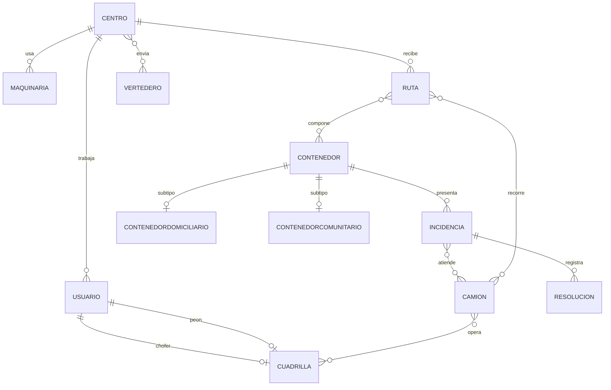

# Primera versión del modelo físico

El modelo se implementa en MariaDB. La aplicación de esta entrega usa las tablas
`usuario`, `contenedor`, `camion` e `incidencia`; las demás tablas quedan creadas
para conservar el modelo físico completo aprobado por el equipo.

## Tablas del modelo

1. `centro`: centros de acopio.
2. `vertedero`: destinos finales de los residuos.
3. `maquinaria`: maquinaria asignada a un centro.
4. `usuario`: cuentas, roles y estado de acceso.
5. `cuadrilla`: chofer, peón y horario de trabajo.
6. `camion`: flota, capacidad, estado y disponibilidad.
7. `ruta`: rutas recibidas por cada centro.
8. `contenedor`: ubicación, capacidad, tipo y estado.
9. `contenedordomiciliario`: datos propios del subtipo domiciliario.
10. `contenedorcomunitario`: coordenadas del subtipo comunitario.
11. `incidencia`: reportes asociados a un contenedor.
12. `resolucion`: intentos de solución de una incidencia.
13. `atiende`: camiones que atienden incidencias.
14. `compone`: orden de los contenedores dentro de una ruta.
15. `enviares`: residuos enviados desde un centro a un vertedero.
16. `opera`: operación de un camión por una cuadrilla.
17. `recorrido`: recorridos realizados y volumen recolectado.

Las claves primarias, claves foráneas, restricciones y tipos exactos están en
`ddl.sql`. `dump-estructura.sql` contiene la misma estructura sin datos y
`datos-prueba.sql` carga registros para demostrar la aplicación.