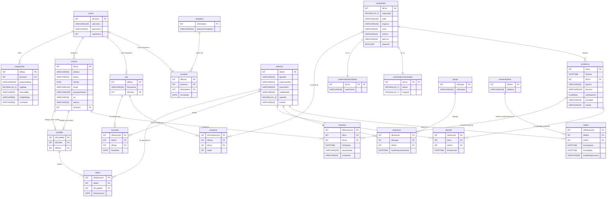

# Primera versión del modelo físico

El modelo se implementa en MySQL. La aplicación de esta entrega usa todas las tablas finales

```mermaid
erDiagram
    centro ||--o{ maquinaria : "tiene"
    centro ||--o{ usuario : "emplea a"
    centro ||--o{ ruta : "tiene asignada"
    centro ||--o{ enviares : "envía residuos a"
    vertedero ||--o{ enviares : "recibe de"
    
    usuario ||--o| cuadrilla : "trabaja como chofer"
    usuario ||--o| cuadrilla : "trabaja como peón"
    cuadrilla ||--o{ opera : "realiza"
    
    vehiculo ||--o{ opera : "es operado en"
    vehiculo ||--o{ recorrido : "realiza"
    vehiculo ||--o{ atiende : "asiste a"
    vehiculo ||--o{ estaciona : "aparca en"
    vehiculo ||--o{ repara : "ingresa a"
    
    ruta ||--o{ recorrido : "es cubierta por"
    ruta ||--o{ compone : "está formada por"
    
    contenedor ||--o{ compone : "es parte de"
    contenedor ||--|| contenedordomiciliario : "es un"
    contenedor ||--|| contenedorcomunitario : "es un"
    contenedor ||--o{ incidencia : "registra"
    
    incidencia ||--o{ resuelve : "es gestionada por"
    usuario ||--o{ resuelve : "gestiona"
    incidencia ||--o{ atiende : "es atendida mediante"
    
    garaje ||--o{ estaciona : "alberga"
    mantenimiento ||--o{ repara : "realiza mantenimiento de"

    centro {
        INT idCentro PK
        VARCHAR(150) ubiCentro
        VARCHAR(30) tipoCentro
        INT capCentro
    }

    vertedero {
        INT idVertedero PK
        VARCHAR(150) ubicacionVertedero
    }

    maquinaria {
        INT idMaq PK
        INT idCentro FK
        VARCHAR(200) propositoMaq
        DECIMAL(10_2) capMaq
        VARCHAR(50) marcaMaq
        VARCHAR(50) modeloMaq
        VARCHAR(50) numSerie
    }

    usuario {
        INT idUsu PK
        VARCHAR(50) priNom
        VARCHAR(20) telUsu
        DATE fchNac
        VARCHAR(100) email
        VARCHAR(255) passwordHash
        VARCHAR(30) rol
        VARCHAR(20) estUsu
        INT idCentro FK
    }

    cuadrilla {
        INT idCuadrilla PK
        INT idChofer FK
        INT idPeon FK
    }

    vehiculo {
        INT idVehi PK
        VARCHAR(30) tipoVehi
        VARCHAR(10) matriculaVehi
        VARCHAR(50) marcaVehi
        VARCHAR(50) modeloVehi
        DECIMAL(10_2) capVehi
        VARCHAR(20) estVehi
    }

    ruta {
        INT idRuta PK
        VARCHAR(30) frecuencia
        INT idCentro FK
    }

    recorrido {
        INT idRecorrido PK
        INT idVehi FK
        INT idRuta FK
        DATE fechaRec
    }

    contenedor {
        INT idCon PK
        DECIMAL(10_2) capacidad
        VARCHAR(100) calle
        VARCHAR(100) esquina
        VARCHAR(30) zona
        VARCHAR(20) estCon
        VARCHAR(30) tipoCon
        BOOLEAN repuesto
    }

    contenedordomiciliario {
        INT idCon PK "FK"
        VARCHAR(30) numPuerta
    }

    contenedorcomunitario {
        INT idCon PK "FK"
        DECIMAL(10_7) latitud
        DECIMAL(10_7) longitud
    }

    incidencia {
        INT idInci PK
        DATETIME fchaInci
        INT idCon FK
        VARCHAR(30) tipoInci
        VARCHAR(200) descInci
        CHAR(64) cedHashInci
        VARCHAR(20) prioridad
        VARCHAR(20) estado
    }

    resuelve {
        INT idResolucion PK
        INT idInci FK
        INT idUsu FK
        DATETIME fchIntento
        VARCHAR(200) descEstado
        VARCHAR(20) estIntento
    }

    atiende {
        INT idAtencion PK
        INT idInci FK
        INT idVehi FK
        DATETIME fchAtencion
    }

    compone {
        INT idComposicion PK
        INT idRuta FK
        INT idCon FK
        INT orden
    }

    opera {
        INT idOperacion PK
        INT idVehi FK
        INT idCuadrilla FK
        DATE fchOperacion
    }

    enviares {
        INT idEnvio PK
        INT idCentro FK
        INT idVertedero FK
        DATE fchVertido
    }

    garaje {
        INT idGaraje PK
        VARCHAR(150) ubiGaraje
    }

    mantenimiento {
        INT idMant PK
        VARCHAR(150) ubiMant
    }

    estaciona {
        INT idEstacion PK
        INT idGaraje FK
        INT idVehi FK
        DATETIME horaEstacionamiento
    }

    repara {
        INT idReparacion PK
        INT idMant FK
        INT idVehi FK
        DATETIME horaIngreso
        DATETIME horaSalida
        VARCHAR(30) estadoReparacion
    }
```